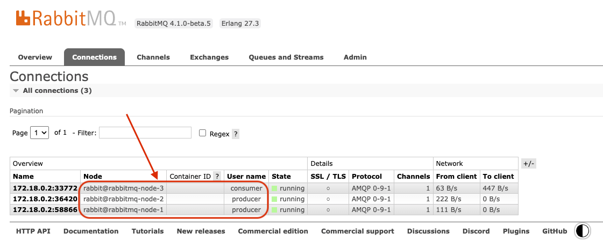

# RabbitMQ Multi-Node Cluster with Traefik (as Load Balancer)

In this setup, we are using Traefik for load balancing. We have one consumer and two producers, all connected to different nodes, but still sharing the data.

## Overview

- **Load Balancer**: Traefik
- **Nodes**: 3, and all are connected to form a cluter

check `docker-compose.yml` file, there we have everything to start [Traefik](https://traefik.io/), and 3 [RabbitMQ](https://www.rabbitmq.com/) nodes, and then form a cluster.  pay attention to `entrypoint` of Node1 is different then `entrypoint` of Node2/Node3.

As Node 1 will start, and later node2/node3 will join the node1 to form a cluster.

## Key Points
- Load balancer will do round-robin, and will assign next node to next upcoming client be it consumer or producer. 
- So Producers and Consumers might be connected to different nodes.
- Becuase of Cluster then are sharing the data (messages)
- Check attached screenshot, I started two `Producers` those are connected to `node-1` and `node-2` respectively, and later when I stated `Consume` it got connected to `node-3`, and consumer can consume messages produced by both the producers.

## Benefits

- **Scalability**: Easily add more producers or consumers, and `Nodes` on same cluster.
- **Reliability**: Messages are shared across nodes, ensuring no single point of failure.
- **Efficiency**: Traefik efficiently balances the load across multiple nodes.

## Conclusion

This setup demonstrates how RabbitMQ can be used in a multi-node cluster environment with Traefik for load balancing, allowing sharing the load to multiple nodes.